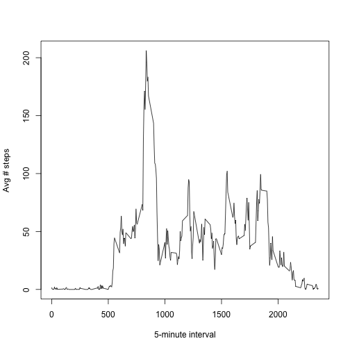
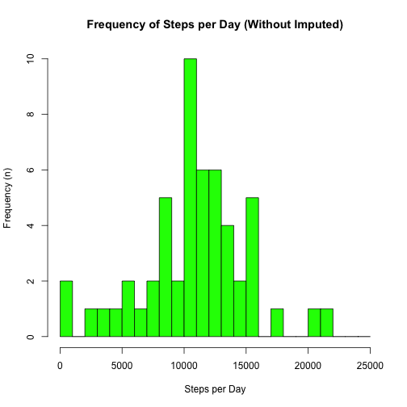
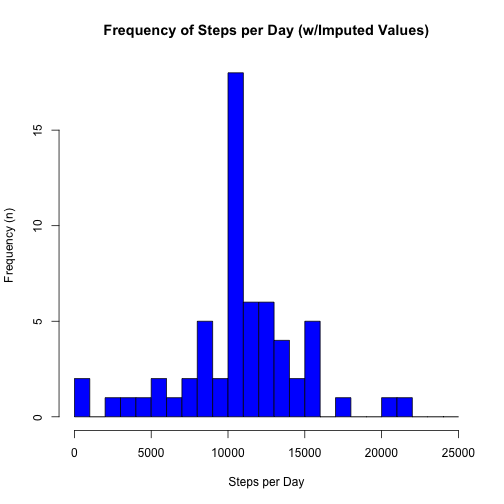
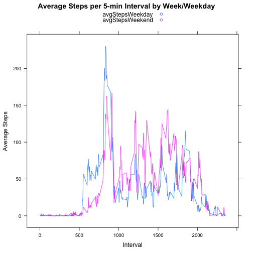

# Reproducible Research: Peer Assessment 1
Author: Elizabeth Sall
Date: 2014-06-15

## Loading and preprocessing the data

```r
data <- read.csv(unzip("activity.zip"))

data[0:5,]
```

```
##   steps       date interval
## 1    NA 2012-10-01        0
## 2    NA 2012-10-01        5
## 3    NA 2012-10-01       10
## 4    NA 2012-10-01       15
## 5    NA 2012-10-01       20
```

```r
summary(data)
```

```
##      steps               date          interval   
##  Min.   :  0.0   2012-10-01:  288   Min.   :   0  
##  1st Qu.:  0.0   2012-10-02:  288   1st Qu.: 589  
##  Median :  0.0   2012-10-03:  288   Median :1178  
##  Mean   : 37.4   2012-10-04:  288   Mean   :1178  
##  3rd Qu.: 12.0   2012-10-05:  288   3rd Qu.:1766  
##  Max.   :806.0   2012-10-06:  288   Max.   :2355  
##  NA's   :2304    (Other)   :15840
```

## What is mean total number of steps taken per day?

**Instructions** 

 Ignore missing values in dataset
 1. Make a histogram of the total number of steps taken each day
 1. Calculate and report the mean and median total number of steps taken per day
 
---

### Histogram of Steps per Day

```r
#ignore NA values for steps
naSteps <- is.na(data$steps)

stepsPerDay <- tapply(data$steps[!naSteps], data$date[!naSteps], sum)

# based on range from 0 to 25,000ish, use breaks of every 1000 steps 

hist(stepsPerDay, 
     main="Frequency of Steps per Day",
     breaks = seq(0, 25000, 1000),
     col  = "green",
     xlab = "Steps per Day",
     ylab = "Frequency (n)",
     )
```

 
### Mean & median steps per day

```r
mean(stepsPerDay,na.rm = TRUE)
```

```
## [1] 10766
```

```r
median(stepsPerDay, na.rm=TRUE)
```

```
## [1] 10765
```
## What is the average daily activity pattern?

**Instructions**

 1. Make a time series plot (i.e. type = "l") of the 5-minute interval (x-axis) and the average number of steps taken, averaged across all days (y-axis)
 1. Which 5-minute interval, on average across all the days in the dataset, contains the maximum number of steps?
 
 ---

### Time series of average steps per 5 minute interval

```r
# stepsPerInterval <- tapply(data$steps[!naSteps], data$interval[!naSteps], mean)

stepsPerInterval <- aggregate(data$steps, by=list(Category=data$interval), FUN=mean, na.rm=TRUE)
colnames(stepsPerInterval) <- c("interval", "AvgSteps")

plot(stepsPerInterval$interval, stepsPerInterval$AvgSteps, 
     ylab="Avg # steps", 
     xlab="5-minute interval", 
     type="n")
lines(stepsPerInterval$interval,stepsPerInterval$AvgSteps,  
      type= "l")
```

 
### Most Active 5-Minute Interval

```r
stepsPerInterval[which.max(stepsPerInterval$AvgSteps),]
```

```
##     interval AvgSteps
## 104      835    206.2
```

## Imputing missing values

**Instructions**
Note that there are a number of days/intervals where there are missing values (coded as NA). The presence of missing days may introduce bias into some calculations or summaries of the data.

 1. Calculate and report the total number of missing values in the dataset (i.e. the total number of rows with NAs)
 1. Devise a strategy for filling in all of the missing values in the dataset. The strategy does not need to be sophisticated. For example, you could use the mean/median for that day, or the mean for that 5-minute interval, etc.
 1. Create a new dataset that is equal to the original dataset but with the missing data filled in.
 1. Make a histogram of the total number of steps taken each day and Calculate and report the mean and median total number of steps taken per day. Do these values differ from the estimates from the first part of the assignment? What is the impact of imputing missing data on the estimates of the total daily number of steps?

### Calculate # of Missing Values

```r
### Number of Missing Values
length(naSteps[naSteps==TRUE])
```

```
## [1] 2304
```

```r
### Of Total Observations
length(naSteps)
```

```
## [1] 17568
```

### Devise a strategy for filling in all of the missing values in the dataset. Create new dataset with missing data filled in.

```r
# use average by interval to fill in missing data
isteps <- merge(data, stepsPerInterval)
isteps["steps"][is.na(isteps["steps"])] = isteps["AvgSteps"][is.na(isteps["steps"])] 

isteps[1:5,]
```

```
##   interval steps       date AvgSteps
## 1        0 1.717 2012-10-01    1.717
## 2        0 0.000 2012-11-23    1.717
## 3        0 0.000 2012-10-28    1.717
## 4        0 0.000 2012-11-06    1.717
## 5        0 0.000 2012-11-24    1.717
```

```r
summary(isteps)
```

```
##     interval        steps               date          AvgSteps     
##  Min.   :   0   Min.   :  0.0   2012-10-01:  288   Min.   :  0.00  
##  1st Qu.: 589   1st Qu.:  0.0   2012-10-02:  288   1st Qu.:  2.49  
##  Median :1178   Median :  0.0   2012-10-03:  288   Median : 34.11  
##  Mean   :1178   Mean   : 37.4   2012-10-04:  288   Mean   : 37.38  
##  3rd Qu.:1766   3rd Qu.: 27.0   2012-10-05:  288   3rd Qu.: 52.83  
##  Max.   :2355   Max.   :806.0   2012-10-06:  288   Max.   :206.17  
##                                 (Other)   :15840
```

### Does it make a difference to impute missing values?
#### Make a histogram of the total number of steps taken each day

```r
iStepsPerDay <- tapply(isteps$steps, isteps$date, sum)

hist(stepsPerDay, 
     main="Frequency of Steps per Day (Without Imputed)",
     breaks = seq(0, 25000, 1000),
     col  = "green",
     xlab = "Steps per Day",
     ylab = "Frequency (n)",
     )
```

 

```r
hist(iStepsPerDay, 
     main="Frequency of Steps per Day (w/Imputed Values)",
     breaks = seq(0, 25000, 1000),
     col  = "blue",
     xlab = "Steps per Day",
     ylab = "Frequency (n)",
     )
```

 
#### Calculate and report the mean and median total number of steps taken per day. 
 * Do these values differ from the estimates from the first part of the assignment? 
 * What is the impact of imputing missing data on the estimates of the total daily number of steps?

```r
# Without imputation
mean(stepsPerDay,na.rm = TRUE)
```

```
## [1] 10766
```

```r
median(stepsPerDay, na.rm=TRUE)
```

```
## [1] 10765
```

```r
# Withimputation
mean(iStepsPerDay)
```

```
## [1] 10766
```

```r
median(iStepsPerDay)
```

```
## [1] 10766
```

 * there are not significant differences between mean with and without imputation b/c 
 I used the mean of the interval. Although there are slight differences.

## Are there differences in activity patterns between weekdays and weekends?

**Instructions**
For this part the weekdays() function may be of some help here. Use the dataset with the filled-in missing values for this part.

 1. Create a new factor variable in the dataset with two levels – “weekday” and “weekend” indicating whether a given date is a weekday or weekend day.
 1. Make a panel plot containing a time series plot (i.e. type = "l") of the 5-minute interval (x-axis) and the average number of steps taken, averaged across all weekday days or weekend days (y-axis). 

### Create weekend weekday factor variable


```r
isteps$day <- weekdays(as.Date(isteps$date))
weekend <- subset(isteps, isteps$day == "Saturday" | isteps$day == "Sunday")
weekday <- subset(isteps, !(isteps$day == "Saturday" | isteps$day == "Sunday"))
```

### Make panel plot showing difference between weekend and weekday day patterns


```r
# resummarize by weekday and weekend
steps_by_int_weekend <- aggregate(weekend$steps, 
                                  by=list(Category=weekend$interval), 
                                  FUN=mean, 
                                  na.rm=TRUE)
colnames(steps_by_int_weekend)<-c("interval","avgStepsWeekend")
steps_by_int_weekday <- aggregate(weekday$steps, 
                                  by=list(Category=weekday$interval), 
                                  FUN=mean, 
                                  na.rm=TRUE)
colnames(steps_by_int_weekday)<-c("interval","avgStepsWeekday")

steps_by_int <- merge(steps_by_int_weekday, steps_by_int_weekend)

# panel plot

library(lattice)

xyplot(avgStepsWeekday + avgStepsWeekend ~ interval, 
    data = steps_by_int,
    type = "l",
    main="Average Steps per 5-min Interval by Week/Weekday", 
    ylab="Average Steps", 
    xlab="Interval",
    auto.key=TRUE)
```

 
