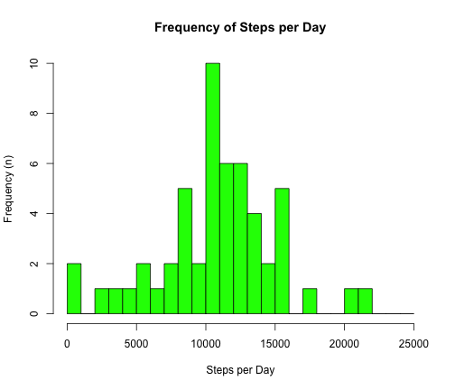

# Reproducible Research: Peer Assessment 1
Author: Elizabeth Sall
Date: 2014-06-15

## Loading and preprocessing the data

```r
data <- read.csv(unzip("activity.zip"))

data[0:5,]
```

```
##   steps       date interval
## 1    NA 2012-10-01        0
## 2    NA 2012-10-01        5
## 3    NA 2012-10-01       10
## 4    NA 2012-10-01       15
## 5    NA 2012-10-01       20
```

```r
summary(data)
```

```
##      steps               date          interval   
##  Min.   :  0.0   2012-10-01:  288   Min.   :   0  
##  1st Qu.:  0.0   2012-10-02:  288   1st Qu.: 589  
##  Median :  0.0   2012-10-03:  288   Median :1178  
##  Mean   : 37.4   2012-10-04:  288   Mean   :1178  
##  3rd Qu.: 12.0   2012-10-05:  288   3rd Qu.:1766  
##  Max.   :806.0   2012-10-06:  288   Max.   :2355  
##  NA's   :2304    (Other)   :15840
```

## What is mean total number of steps taken per day?

**Instructions** 

 Ignore missing values in dataset
 1. Make a histogram of the total number of steps taken each day
 1. Calculate and report the mean and median total number of steps taken per day
 
---

### Histogram of Steps per Day

```r
#ignore NA values for steps
naSteps <- is.na(data$steps)

stepsPerDay <- tapply(data$steps[!naSteps], data$date[!naSteps], sum)

# based on range from 0 to 25,000ish, use breaks of every 1000 steps 

hist(stepsPerDay, 
     main="Frequency of Steps per Day",
     breaks = seq(0, 25000, 1000),
     col  = "green",
     xlab = "Steps per Day",
     ylab = "Frequency (n)",
     )
```

 
### Mean & median steps per day

```r
mean(stepsPerDay,na.rm = TRUE)
```

```
## [1] 10766
```

```r
median(stepsPerDay, na.rm=TRUE)
```

```
## [1] 10765
```
## What is the average daily activity pattern?


## Imputing missing values


## Are there differences in activity patterns between weekdays and weekends?
